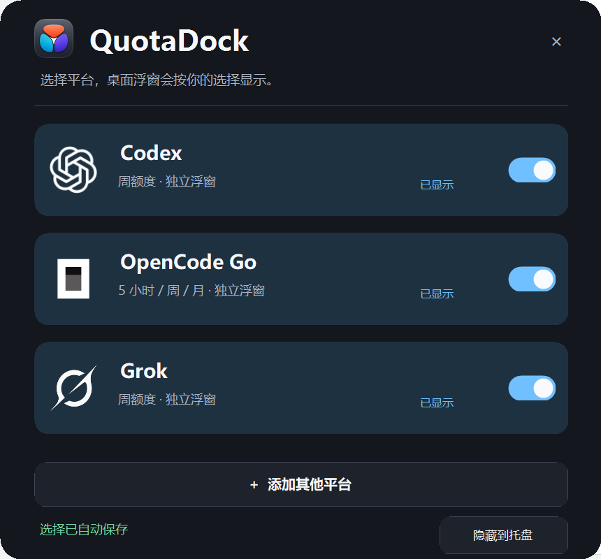
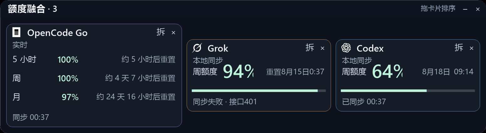

# QuotaDock

[](https://github.com/BigQ749/quotadock/releases)
[](https://github.com/BigQ749/quotadock/actions)
[](LICENSE)
[](docs/download.md)

一个安静、可组合的 Windows AI 额度浮窗：把 Codex、Grok、OpenCode Go 和自定义平台放在桌面边缘，按需单独打开，也可以拖到一起成为一个真正可整体移动的融合窗口。

QuotaDock is a local-first Windows quota dashboard and floating overlay for Codex, Grok, OpenCode Go, Claude Code, and custom providers. It reads local quota snapshots, keeps provider cards independent or fused, and leaves downloads, updates, and credential handling under the user's control.





## 为什么是 QuotaDock

| ✦ | 能力 | 体验 |
|---|---|---|
| 🧩 | 单卡片或融合窗口 | 每个平台可以单独移动；拖近后由一个宿主窗口承载多个卡片，避免“两个窗口假吸附”。 |
| 🫥 | 左、右、上藏边 | 自动藏边只作用于三个侧边；下边不触发藏边，露出的手柄长度固定。 |
| 🖱️ | 真实拖拽与拆分 | 融合窗口可整体拖动；把某张卡片拖出窗口，才会拆成独立浮窗。 |
| 🔄 | 运行状态同步 | 管理中心显示已打开、已吸附、已最小化和未打开，并从宿主状态实时校正。 |
| 🛡️ | 本地优先 | UI 只读本地 JSON；仓库不包含 Cookie、凭据、真实额度快照或个人路径。 |
| ⬆️ | 用户控制更新 | 启动时检查 GitHub Release；标题栏的 `↑ 检查更新` 可查看当前版本并手动检查，发现新版本后由用户决定是否下载。 |

## 下载与系统支持

当前公开发行版是 Windows 桌面应用。请先看 [下载选择指南](docs/download.md)，再从 [GitHub Releases](https://github.com/BigQ749/quotadock/releases) 下载对应版本。

| 设备 | 下载 | 状态 |
|---|---|---|
| Windows 10/11 x64 | `QuotaDock-Setup-X.Y.Z.exe` | ✅ 主要验证目标 |
| Windows 10/11 x86 | 同一安装包 | ✅ Inno Setup x86 兼容模式；请使用相同版本的 Windows PowerShell |
| Windows ARM64 | 暂无原生包 | ⚠️ 未作为发行版承诺；不要把 x64 安装包称为 ARM 原生版 |
| macOS / Linux | 暂不提供 | 🧭 PowerShell 5.1 + WinForms 版本尚未跨平台 |

安装器支持：选择安装目录、阅读 MIT 许可证、当前用户范围安装、不要求管理员权限、创建开始菜单/桌面快捷方式，以及可选的“登录 Windows 时自动启动”。安装不会删除 `%LOCALAPPDATA%\QuotaDock` 中的额度配置和凭据。

## 功能

- 在一个 QuotaDock 管理中心中选择 Codex、Grok、OpenCode Go 或自定义平台。
- Codex/Grok 可显示周额度；OpenCode Go 可显示 5 小时、周、月窗口；自定义平台最多 3 个窗口。
- 单独浮窗支持移动、最小化、关闭和左/右/上藏边。
- 多个卡片拖近后合成一个宿主窗口；管理中心或浮窗右键都可以按平台关闭，关闭到最后一张时会留下独立卡片，不会误关整组。
- 高 DPI 感知绘制，统一官方品牌标识，清晰的百分比与同步时间。
- OpenCode Go 支持 Chrome 页面桥接；也可以一次配置后用后台同步脚本按约 60 秒更新。
- 通过管理中心添加其他平台：平台名称、英文标识、本地 JSON 路径和可选品牌图标都可自定义。

## 安装

1. 打开 [Releases](https://github.com/BigQ749/quotadock/releases)。
2. 下载 `QuotaDock-Setup-*.exe` 和同版本的 `SHA256SUMS.txt`。
3. 校验 SHA-256 后运行安装器，按向导选择目录、许可证和开机启动选项。
4. 通过桌面/开始菜单快捷方式启动 QuotaDock。

安装器由 `.github/workflows/release.yml` 在 Windows runner 上使用 Inno Setup 构建；源码仓库不提交编译机的个人数据。

## 第一次配置额度数据

QuotaDock 的视图层不负责猜测平台接口。同步器或用户自己的合规脚本应把脱敏后的额度结果写入本地 JSON。公开仓库只提供虚构示例：

```powershell
$state = Join-Path $env:LOCALAPPDATA 'QuotaDock'
New-Item -ItemType Directory -Path $state -Force | Out-Null
Copy-Item .\examples\quota_sources.example.json (Join-Path $state 'quota_sources.json')
```

也可以通过环境变量指定数据源：

```powershell
$env:QUOTADOCK_CODEX_DATA = 'C:\path\to\codex.json'
$env:QUOTADOCK_GROK_DATA = 'C:\path\to\grok.json'
$env:QUOTADOCK_OPENCODE_DATA = 'C:\path\to\opencode_go.json'
```

统一数据结构示例：

```json
{
  "title": "Claude Code",
  "badge": "本地同步",
  "updatedAt": "2026-01-01T00:00:00Z",
  "windows": [
    {
      "label": "周额度",
      "remainingPercent": 75,
      "resetText": "示例：周六 12:00"
    }
  ]
}
```

同步失败、401/403、登录过期或页面结构变化时，应显示“同步失败/时间未知”，不能把错误伪装成 0% 额度。

## OpenCode Go

推荐使用 `opencode-go-quota-bridge`：它只匹配官方 workspace 页面，把额度数值发送到本机 `127.0.0.1`，不读取 Cookie、密码或 API Key。完整说明见 [`opencode-go-quota-bridge/README.md`](opencode-go-quota-bridge/README.md)。

如果希望关闭 Chrome 后仍能更新，可配置后台同步：

```powershell
powershell -NoProfile -ExecutionPolicy Bypass -File .\configure_opencode_go_background.ps1 -WorkspaceId wrk_xxx
```

脚本隐藏输入 `auth` Cookie，并使用当前 Windows 用户范围 DPAPI 加密保存。不要把 Cookie 粘贴到仓库、Issue、截图或聊天记录中。

## 更新机制

QuotaDock 的更新分成三步：

1. 启动时检查 GitHub Releases，默认 24 小时内不重复请求。
2. 管理中心标题栏的 `↑ 检查更新` 可查看当前版本并立即检查一次，绕过本地检查缓存。
3. 发现更高版本后弹出下载提示；用户点击“打开下载页”后自行下载安装，不会静默覆盖，也不会上传本地额度数据。

维护者只需修改 `VERSION`、提交匹配的 `vX.Y.Z` tag，工作流就会构建安装器、生成 SHA-256 文件并发布 Release。详细步骤见 [`docs/release.md`](docs/release.md)。

## 从源码运行与构建

```powershell
Set-Location .\quotadock
powershell -NoProfile -ExecutionPolicy Bypass -File .\quota_center.ps1
```

本地构建需要 Inno Setup 6 的 `ISCC.exe`：

```powershell
powershell -NoProfile -ExecutionPolicy Bypass -File .\packaging\build.ps1 -Clean
```

提交前运行：

```powershell
powershell -NoProfile -ExecutionPolicy Bypass -File .\tests\selftest.ps1
```

## 架构与扩展

- [`quota_center.ps1`](quota_center.ps1)：平台选择、添加/删除自定义平台、托盘菜单和更新入口。
- [`quota_fusion_host.ps1`](quota_fusion_host.ps1)：唯一真实宿主窗口，负责卡片绘制、拖拽、融合、拆分、藏边和运行状态。
- [`launch_quota_small_widget.ps1`](launch_quota_small_widget.ps1)：启动平台同步器和宿主请求。
- [`opencode_go_background_sync.ps1`](opencode_go_background_sync.ps1)：可选的 OpenCode Go 后台同步。
- [`opencode-go-quota-bridge/`](opencode-go-quota-bridge/)：Chrome 页面桥接扩展。

先读 [`llms.txt`](llms.txt)、[`docs/architecture.md`](docs/architecture.md) 和 [`docs/provider-adapter.md`](docs/provider-adapter.md)，再修改项目。新增平台应优先新增适配器或本地 JSON 源，不要复制一套新的原生浮窗。

## 常见问题

请先看 [`docs/troubleshooting.md`](docs/troubleshooting.md)。常见根因包括：

- 管理中心显示与实际窗口不一致：检查宿主进程和 `%LOCALAPPDATA%\QuotaDock\host_state.json`。
- 右键菜单报错：重启当前 QuotaDock 宿主，确认使用同一版本脚本；不要同时运行旧版独立浮窗。
- OpenCode Go 不更新：检查扩展是否加载、后台凭据是否过期、接口是否返回 401/403，以及 `updatedAt` 是否变化。
- 字体或百分比模糊：确认 Windows 缩放设置和原生 DPI 感知是否被组织策略禁用。

## 贡献与安全

欢迎提交可复现的 Bug、脱敏日志和改进建议。请不要提交 Cookie、session token、API key、真实额度快照、个人绝对路径或含有桌面的截图；安全问题请按 [`SECURITY.md`](SECURITY.md) 联系。

代码采用 MIT License。第三方平台名称、商标和图标归各自权利人所有，详见 [`TRADEMARKS.md`](TRADEMARKS.md)。
